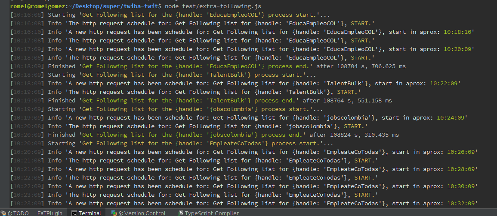

# twiba tests

## Install npm dependencies  

- `npm install`

## Test 1 - Retrieve id's for twitter handles: 

 `node test/test-1.js | ./node_modules/.bin/bunyan`

Example output: 

```
[10:37:56] Info 'The http request schedule for: Get users data of { 'handle': EducaEmpleoCOL}, START.'

{ screen_name: 'EducaEmpleoCOL', data: '3354898635' }

******************************************************************
[10:37:57] Info 'A new http request has been schedule for: Get users data of { 'handle': TalentBulk}, start in aprox: 10:39:57'
[10:38:56] Info 'The http request schedule for: Get users data of { 'handle': TalentBulk}, START.'

{ screen_name: 'TalentBulk', data: '1471026043' }

******************************************************************
[10:38:57] Info 'A new http request has been schedule for: Get users data of { 'handle': jobscolombia}, start in aprox: 10:41:57'
```

## Test 2 - Retrieve meta data for twitter handles

 `node test/test-2.js | ./node_modules/.bin/bunyan`

  Metadata to collect: 
  
  - What is the data of the last tweet?
  - What is the total number of tweets for this account?
  - How many followers does this account have?
  - How many accounts does this account follow?
  - Any other meta-data that of the account that you think is relevant (Bio or description, location)

Example output: 

```
[10:37:17] Info 'The http request schedule for: Get users data of { 'handle': EducaEmpleoCOL}, START.'

{ handle: 'EducaEmpleoCOL',
  id: '3354898635',
  'Date of the last tweet': 'Sat Oct 22 15:33:53 +0000 2016',
  'Total number of tweets for this account': 37216,
  'Total of followers does this account have': 924,
  'Total of accounts does this account follow': 476,
  'Description:': 'En nuestro portal encontrará las mejores ofertas de Educación y Empleo para toda Colombia.',
  'Location:': 'Colombia' }

******************************************************************
[10:37:17] Info 'A new http request has been schedule for: Get users data of { 'handle': TalentBulk}, start in aprox: 10:39:17'
```

## Test 3 -  Retrieve information of followers

 - Find the names of the accounts that are followers
 - Save these names in a JSON-file on disk, per account a separate file.
 
 `node test/test-3.js | ./node_modules/.bin/bunyan`
 
 Example output (is of extra-following.js program, is the same behavior of test/test-3.js program): 
 
 
  
 
#### Check the /followers folder for already generate followers JSON files.

References: 

- https://dev.twitter.com/rest/public/rate-limiting
- https://blog.twitter.com/2008/what-does-rate-limit-exceeded-mean-updated
